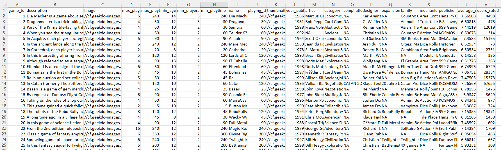

# bgg_dataset
For Collecting Data Assignment 1
Below is a table of the variables in this dataset.
| Variable         | Class     | Description                                         |
|------------------|-----------|-----------------------------------------------------|
| game_id          | character | Unique game identifier                              |
| description      | character | A paragraph of text describing the game             |
| image            | character | URL image of the game                                |
| max_players      | integer   | Maximum recommended players                         |
| max_playtime     | integer   | Maximum recommended playtime (min)                  |
| min_age          | integer   | Minimum recommended age                              |
| min_players      | integer   | Minimum recommended players                         |
| min_playtime     | integer   | Minimum recommended playtime (min)                  |
| name             | character | Name of the game                                     |
| playing_time     | integer   | Average playtime                                     |
| thumbnail        | character | URL thumbnail of the game                            |
| year_published   | integer   | Year the game was published                          |
| artist           | character | Artist for game art                                  |
| category         | character | Categories for the game (separated by commas)        |
| compilation      | character | If part of a multi-compilation - name of compilation |
| designer         | character | Game designer                                       |
| expansion        | character | If there is an expansion pack - name of expansion    |
| family           | character | Family of game - equivalent to a publisher          |
| mechanic         | character | Game mechanic - how the game is played, separated by comma |
| publisher        | character | Company/person who published the game, separated by comma |
| average_rating   | double    | Average rating on Board Games Geek (1-10)            |
| users_rated      | double    | Number of users that rated the game                  |

Since the file is too large for a preview on GitHug web, here is a screenshot overview of what the dataset looks like:

